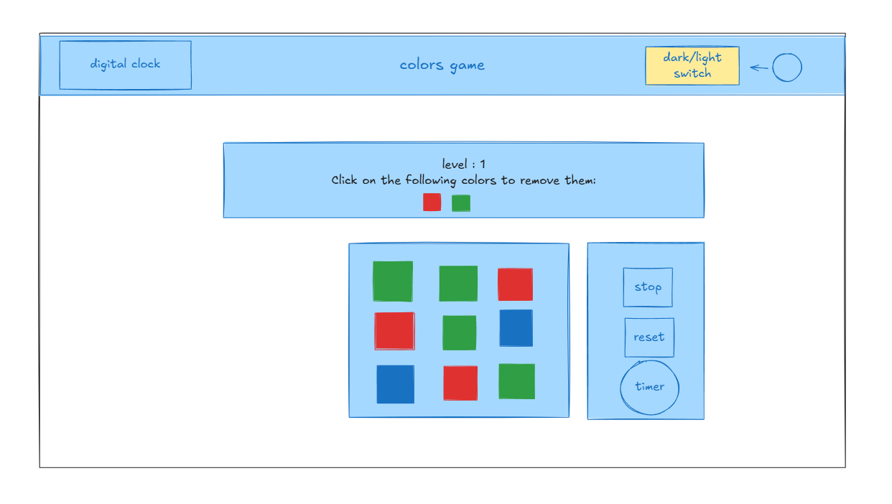
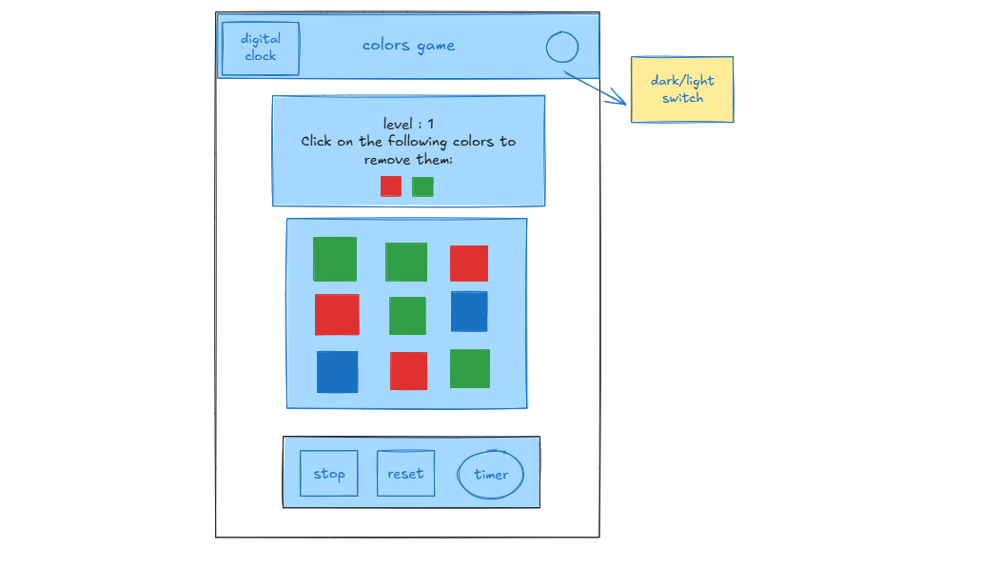
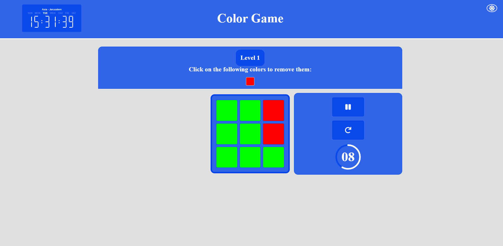
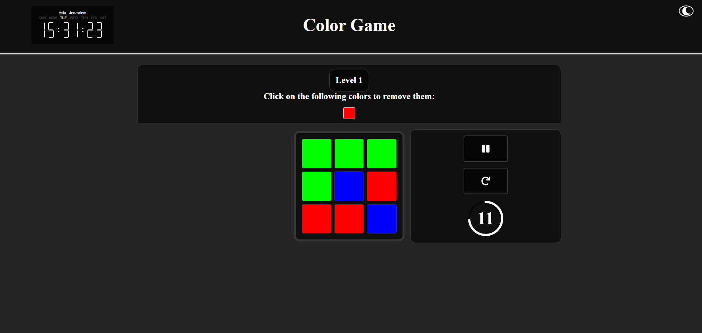
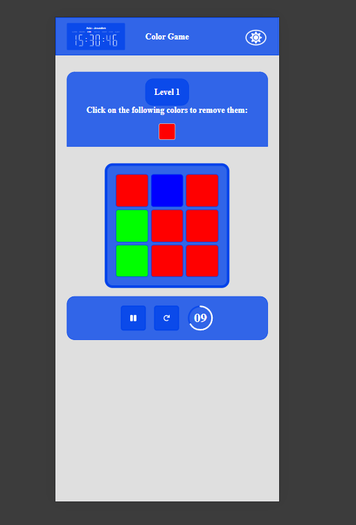
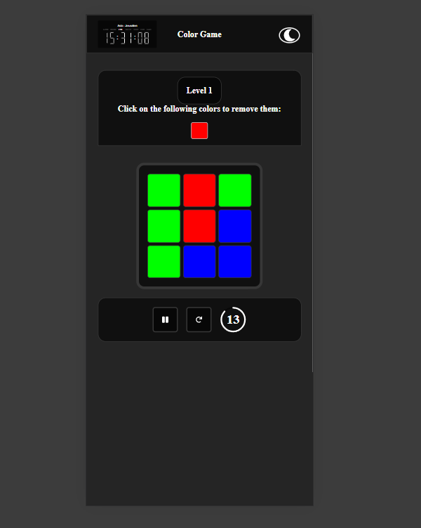

# 🎨 Color Game

An interactive color-matching game with increasing difficulty, custom hooks, and modern responsive design.

## 🚀 Live Demo
You can play the game here: [Demo via GitHub Pages](https://adimalka14.github.io/grid-color-game/)
---


## 🧠 Features
- Uses `useReducer` for managing complex game state
- Responsive layout using pure CSS and `Sass`
- Dark/Light theme toggle
- Game instructions and dynamic feedback
- Custom countdown timer with pause/resume
- Integration of custom NPM packages:
    - [`my-awesome-react-timer`](https://www.npmjs.com/package/my-awesome-react-timer) – built from scratch by me
    - [`my-awesome-react-digital-clock`](https://www.npmjs.com/package/my-awesome-react-digital-clock) – built from scratch by me

## 🧰 Technologies Used

| Category         | Libraries / Tools |
|------------------|-------------------|
| **Frontend**     | React 19, React DOM, SCSS |
| **Hooks & Logic**| `useReducer`, custom hooks (`useTimer`) |
| **UI**           | React Icons |
| **Tooling**      | Vite, ESLint, Prettier |
| **Deployment**   | GitHub Pages (via `gh-pages`) |
| **Type Support** | `@types/react`, `@types/react-dom` |
| **Styling**      | SCSS (via `sass` package) |

---

## 🚀 Getting Started

```bash
git clone https://github.com/adimalka14/grid-color-game.git
cd color-game
npm install
npm run dev
```

---

## 📸 Screenshots / Demo

### Plan
#### Desktop


#### Mobile


### Result

#### Desktop
##### Light theme


##### Dark theme


#### Mobile
##### Light theme


##### Dark theme


---
